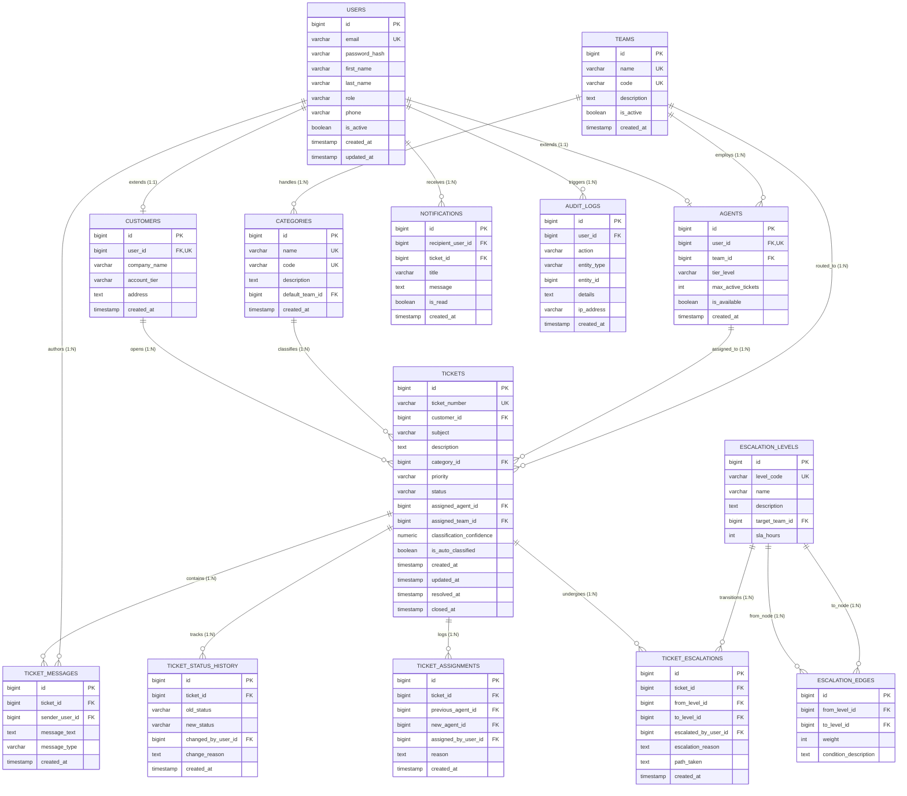

# Customer Support Ticketing System - Entity Relationship (ER) Model

## 1. Overview
The **Customer Support Ticketing System** database is designed for enterprise SaaS helpdesk operations. It enforces relational integrity, 3NF/BCNF normalization, and strict referential constraints across 14 tables.

---

## 2. Mermaid ER Diagram

---

## 3. Entity Relationships & Cardinalities

1. **User to Customer (1 : 0..1)**: A user with `ROLE_CUSTOMER` has exactly one customer profile.
2. **User to Agent (1 : 0..1)**: A user with `ROLE_AGENT` has exactly one agent profile.
3. **Team to Agent (1 : N)**: A team consists of multiple agents; an agent belongs to at most one team.
4. **Category to Team (N : 1)**: Each category points to a default team for automatic routing.
5. **Customer to Ticket (1 : N)**: A customer may open many support tickets.
6. **Category to Ticket (1 : N)**: Each ticket belongs to exactly one category (predicted by ML classifier or manually modified).
7. **Agent to Ticket (0..1 : N)**: An agent can be assigned multiple tickets.
8. **Team to Ticket (1 : N)**: A ticket is routed to one designated department team.
9. **Ticket to TicketMessage (1 : N)**: A ticket contains an ordered thread of customer responses, agent replies, and internal notes.
10. **EscalationLevel to EscalationEdge (1 : N)**: Graph nodes connect via directed weighted edges representing permissible escalation paths.
11. **Ticket to TicketEscalation (1 : N)**: Historical log of every graph-based escalation traversal applied to the ticket.
