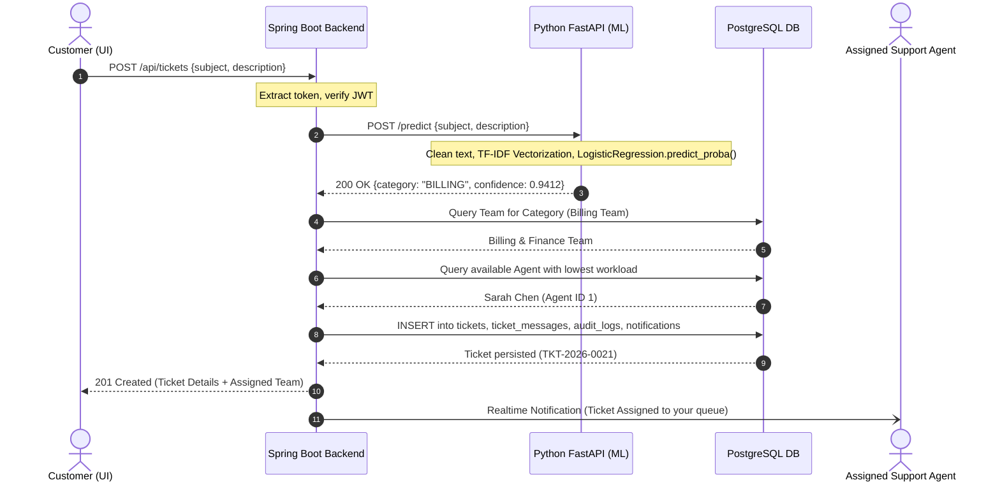
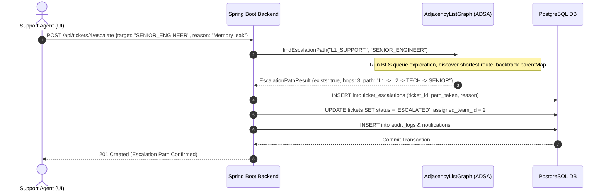

# Multi-Tier System Architecture & Sequence Diagrams

## 1. System Topology Overview

```
                         ┌─────────────────────────────────────────┐
                         │          React 19 + TypeScript          │
                         │           Vite + Tailwind CSS           │
                         │             (Port: 3000)                │
                         └────────────────────┬────────────────────┘
                                              │ HTTP / JSON
                                              ▼
                         ┌─────────────────────────────────────────┐
                         │       Spring Boot 3.3.4 (Java 17)       │
                         │       REST API & Business Logic         │
                         │             (Port: 8080)                │
                         └───────┬─────────────────────────┬───────┘
            REST / WebClient     │                         │ JDBC / Hibernate
                                 ▼                         ▼
            ┌─────────────────────────────┐       ┌─────────────────────────────┐
            │    FastAPI NLP Classifier   │       │   PostgreSQL 16 Relational  │
            │  TF-IDF + Logistic Regress  │       │       Database (3NF)        │
            │        (Port: 8000)         │       │        (Port: 5432)         │
            └─────────────────────────────┘       └─────────────────────────────┘
```

---

## 2. Sequence Diagram: Ticket Creation, Classification & Routing



---

## 3. Sequence Diagram: Graph-Based Ticket Escalation


