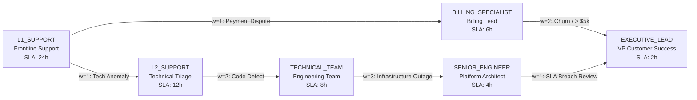

# Customer Support Ticketing System - Master Documentation Hub

Welcome to the comprehensive documentation index for the **Customer Support Ticketing System (SaaS Helpdesk)**. This platform combines natural language machine learning classification with graph-theoretic escalation routing, multi-tenant role-based access control, and normalized PostgreSQL relational persistence.

---

## 📚 Documentation Directory

| Document | Focus Area | Description |
| :--- | :--- | :--- |
| **[Complete Team & Reviewer Guide](file:///c:/Users/prasanna/Downloads/customer-support-ticketing-system/docs/Team-And-Reviewer-Guide.md)** | **Master Team Guide** | **Pin-to-pin guide covering every tab, slide, role, and workflow in simple words (ready for PDF export).** |
| **[Project Architecture](file:///c:/Users/prasanna/Downloads/customer-support-ticketing-system/docs/Project-Architecture.md)** | System Design | 4-tier microservices architecture, network topology, and UML sequence diagrams. |
| **[REST API Reference](file:///c:/Users/prasanna/Downloads/customer-support-ticketing-system/docs/API-Documentation.md)** | API & Endpoints | Complete endpoint catalog (Auth, Tickets, Escalations, ML inference) with JSON payloads. |
| **[ER Diagram](file:///c:/Users/prasanna/Downloads/customer-support-ticketing-system/docs/ER-Diagram.md)** | Database Design | Entity-Relationship diagram in Mermaid with entity attributes and cardinalities. |
| **[Relational Schema & BCNF](file:///c:/Users/prasanna/Downloads/customer-support-ticketing-system/docs/Relational-Schema.md)** | DBMS Theory | Formal relations, Functional Dependencies, and 1NF/2NF/3NF/BCNF normalization proofs. |
| **[Relational Algebra & TRC](file:///c:/Users/prasanna/Downloads/customer-support-ticketing-system/docs/Relational-Algebra.md)** | DMGT / Relational Querying | Relational algebra operations ($\sigma, \pi, \bowtie, \cup, \cap, -, \mathcal{G}$), SQL equivalents, and TRC formulas. |
| **[Escalation Graph](file:///c:/Users/prasanna/Downloads/customer-support-ticketing-system/docs/Escalation-Graph.md)** | ADSA / Graph Theory | Directed weighted graph design, adjacency list representation, BFS shortest path, DFS cycle detection. |
| **[OOP Concepts & SOLID](file:///c:/Users/prasanna/Downloads/customer-support-ticketing-system/docs/OOP-Concepts.md)** | OOPJ / Software Engineering | OOP pillars, SOLID principles implementation in Java Spring Boot, and GoF design patterns. |
| **[Database Dictionary](file:///c:/Users/prasanna/Downloads/customer-support-ticketing-system/database/documentation/Database-Dictionary.md)** | Data Dictionary | Column-by-column breakdown of all 14 PostgreSQL tables with constraints and keys. |
| **[Main System README](file:///c:/Users/prasanna/Downloads/customer-support-ticketing-system/README.md)** | Project Setup & Demo | Installation instructions (Docker & local), test execution, and demo credentials. |

---

## 🏗️ Architecture Summary

```
                      ┌─────────────────────────────────────────┐
                      │          React 19 + TypeScript          │
                      │           Vite + Tailwind CSS           │
                      │             (Port: 3000)                │
                      └────────────────────┬────────────────────┘
                                           │ HTTP / JSON
                                           ▼
                      ┌─────────────────────────────────────────┐
                      │       Spring Boot 3.3.4 (Java 17)       │
                      │       REST API & Business Logic         │
                      │             (Port: 8080)                │
                      └───────┬─────────────────────────┬───────┘
         REST / WebClient     │                         │ JDBC / Hibernate
                              ▼                         ▼
         ┌─────────────────────────────┐       ┌─────────────────────────────┐
         │    FastAPI NLP Classifier   │       │   PostgreSQL 16 Relational  │
         │  TF-IDF + Logistic Regress  │       │       Database (3NF)        │
         │        (Port: 8000)         │       │        (Port: 5432)         │
         └─────────────────────────────┘       └─────────────────────────────┘
```

1. **Presentation Layer (Frontend)**: React 19 SPA running on Vite, providing role-based interfaces for Customers, Agents, and Administrators, with live visualizers for ticket timelines, graph exploration, and classifier playground.
2. **Application Tier (Backend)**: Java 17 Spring Boot microservice providing JWT authentication, SLA state machines, routing logic, and graph algorithms.
3. **Machine Learning Tier (Inference)**: Python FastAPI service running TF-IDF text vectorization and multinomial Logistic Regression to automatically classify ticket categories and calculate confidence scores.
4. **Data Persistence Tier (Database)**: PostgreSQL 16 database normalized to BCNF with 14 tables, constraints, foreign keys, triggers, and audit logging.

---

## 👥 Complete Agent Roster & Demo Accounts

All demo accounts share the standard password: `Password123!`

### Support Agents & Administrative Leadership

| Agent Name | Email | Role | Department Team | Tier Level | Escalation Graph Node | Max Tickets |
| :--- | :--- | :--- | :--- | :--- | :--- | :--- |
| **Alex Morgan** | `admin@supportdesk.io` | `ROLE_ADMIN` | Executive Operations | Operations Director | `EXECUTIVE_LEAD` | Unlimited |
| **Sarah Chen** | `sarah.chen@supportdesk.io` | `ROLE_AGENT` | Billing & Finance | Tier 1 (Lead) | `BILLING_SPECIALIST` | 10 |
| **Marcus Vance** | `marcus.vance@supportdesk.io` | `ROLE_AGENT` | Billing & Finance | Tier 2 | `L2_SUPPORT` | 8 |
| **Elena Rodriguez** | `elena.rodriguez@supportdesk.io` | `ROLE_AGENT` | Technical Support | Tier 1 (Frontline) | `L1_SUPPORT` | 10 |
| **David Kim** | `david.kim@supportdesk.io` | `ROLE_AGENT` | Technical Support | Tier 3 (Architect) | `SENIOR_ENGINEER` | 6 |
| **Priya Patel** | `priya.patel@supportdesk.io` | `ROLE_AGENT` | Account & Security | Tier 1 | `L1_SUPPORT` | 12 |
| **James Wilson** | `james.wilson@supportdesk.io` | `ROLE_AGENT` | Shipping & Logistics | Tier 1 | `L1_SUPPORT` | 10 |
| **Ananya Rao** | `ananya.rao@supportdesk.io` | `ROLE_AGENT` | Product Engineering | Tier 2 | `L2_SUPPORT` | 8 |
| **Lucas Muller** | `lucas.muller@supportdesk.io` | `ROLE_AGENT` | Technical Support | Lead Engineer | `TECHNICAL_TEAM` | 5 |

### Customer Accounts

| Customer Name | Email | Company | SLA Account Tier |
| :--- | :--- | :--- | :--- |
| **John Doe** | `john.doe@acme.com` | Acme Corporation | Enterprise ($SLA < 4h$) |
| **Alice Smith** | `alice.smith@globex.corp` | Globex Industries | Pro ($SLA < 8h$) |
| **Robert Taylor** | `robert.taylor@initech.io` | Initech Solutions | Standard ($SLA < 24h$) |
| **Emily Watson** | `emily.watson@hooli.com` | Hooli Media | Enterprise ($SLA < 4h$) |

---

## 🔀 Escalation Architecture & Path Traversal Guide for Reviewers

The system models ticket escalation using an **Adjacency List Directed Graph** ($G = (V, E, W)$) with Breadth-First Search (BFS) for shortest path computation and Depth-First Search (DFS) for cycle detection.

### 1. Escalation Graph Topology



### 2. Graph Vertices ($V$) & Tier Specifications

| Node Code ($V$) | Tier Description | Assigned Team | Primary Agent(s) | SLA Max Limit |
| :--- | :--- | :--- | :--- | :--- |
| `L1_SUPPORT` | Frontline initial customer triage | Technical & Support | Elena Rodriguez, Priya Patel, James Wilson | 24 Hours |
| `L2_SUPPORT` | Deep log inspection & triage | Technical / Product | Marcus Vance, Ananya Rao | 12 Hours |
| `BILLING_SPECIALIST` | Invoicing, double charge, tax disputes | Billing & Finance | Sarah Chen | 6 Hours |
| `TECHNICAL_TEAM` | Source code bug triage & diagnostics | Technical Support | Lucas Muller | 8 Hours |
| `SENIOR_ENGINEER` | Infrastructure, kernel, security, scale | Technical Support | David Kim | 4 Hours |
| `EXECUTIVE_LEAD` | Enterprise SLA breach & churn executive review | Executive / Product | Alex Morgan | 2 Hours |

### 3. Permissible Escalation Directed Edges ($E$) & Weights ($W$)

| From Tier ($u$) | To Tier ($v$) | Weight ($W$) | Business Escalation Rule / Condition |
| :--- | :--- | :--- | :--- |
| `L1_SUPPORT` | `L2_SUPPORT` | **1** | Technical issue requiring log diagnosis or script execution |
| `L2_SUPPORT` | `TECHNICAL_TEAM` | **2** | Confirmed code regression or reproducible platform defect |
| `TECHNICAL_TEAM` | `SENIOR_ENGINEER` | **3** | Production database timeout, memory leak, or cloud architecture issue |
| `L1_SUPPORT` | `BILLING_SPECIALIST` | **1** | Disputed payment transaction, double debit, or corporate tax invoice |
| `BILLING_SPECIALIST` | `EXECUTIVE_LEAD` | **2** | Disputed refund exceeding $5,000 or strategic account cancellation risk |
| `SENIOR_ENGINEER` | `EXECUTIVE_LEAD` | **1** | Severe contract SLA breach requiring executive customer communication |

---

## 🧪 Step-by-Step Reviewer Evaluation Scenarios

Reviewers can verify and evaluate the escalation paths in real time using the following concrete workflows:

### Scenario 1: Technical Defect Multi-Hop Escalation (BFS Route)
1. **Source**: A customer files a ticket about API timeout (`L1_SUPPORT`).
2. **Reviewer Action**: Open ticket in **Tickets Queue**, click **"Escalate Ticket"**, select Target: `SENIOR_ENGINEER`.
3. **Algorithm Execution**: The Java/React Graph Engine computes BFS from `L1_SUPPORT` to `SENIOR_ENGINEER`:
   $$\text{Path: } \text{L1\_SUPPORT} \xrightarrow{w=1} \text{L2\_SUPPORT} \xrightarrow{w=2} \text{TECHNICAL\_TEAM} \xrightarrow{w=3} \text{SENIOR\_ENGINEER}$$
   - **Total Hops**: $3$ hops.
   - **Accumulated Weight**: $1 + 2 + 3 = 6$.
   - **Target Agent Reassigned**: David Kim (`david.kim@supportdesk.io`).
   - **Audit Record**: Inserted into PostgreSQL table `ticket_escalations` with `path_taken = 'L1_SUPPORT -> L2_SUPPORT -> TECHNICAL_TEAM -> SENIOR_ENGINEER'`.

### Scenario 2: High-Priority Financial Dispute Escalation
1. **Source**: Customer John Doe reports duplicated credit card charge.
2. **Reviewer Action**: Agent Sarah Chen receives ticket at `L1_SUPPORT` / `BILLING_SPECIALIST`.
3. **Escalation Trigger**: Amount exceeds $5,000 threshold.
4. **BFS Path**:
   $$\text{Path: } \text{L1\_SUPPORT} \xrightarrow{w=1} \text{BILLING\_SPECIALIST} \xrightarrow{w=2} \text{EXECUTIVE\_LEAD}$$
   - **Total Hops**: $2$ hops.
   - **Accumulated Weight**: $3$.
   - **Target Agent**: Alex Morgan (`admin@supportdesk.io`).

### Scenario 3: Cycle Prevention Proof (DFS Cycle Detection)
1. In the **Escalation Graph Explorer** (`/escalation_graph` tab), the system runs **Tri-Color Depth-First Search**:
   - `0 (WHITE)`: Unvisited node.
   - `1 (GRAY)`: Currently active in recursion stack.
   - `2 (BLACK)`: Fully evaluated node.
2. A transfer from a downstream tier back to an ancestor (e.g. `EXECUTIVE_LEAD` $\to$ `L1_SUPPORT`) is strictly blocked because:
   $$\text{State}[\text{L1\_SUPPORT}] = \text{GRAY} \implies \text{Back-Edge Detected} \implies \text{Cycle Exception Thrown}$$
3. This guarantees the escalation network remains a strictly **Directed Acyclic Graph (DAG)**.

---

## 🚀 Quick Execution Guide

### Using Docker Compose (Recommended)
```bash
cp .env.example .env
docker compose up --build
```
- **Web App**: [http://localhost:3000](http://localhost:3000)
- **Spring API**: [http://localhost:8080/api](http://localhost:8080/api)
- **FastAPI Docs**: [http://localhost:8000/docs](http://localhost:8000/docs)
- **PostgreSQL**: `localhost:5432` (`customer_support_db`)

### Running Locally (Without Docker)
1. **Database**: Execute `database/schema/01_schema.sql` and `database/seed/02_seed_data.sql` in PostgreSQL.
2. **Classifier**: `cd classifier && pip install -r requirements.txt && uvicorn main:app --port 8000`
3. **Backend**: `cd backend && mvn spring-boot:run`
4. **Frontend**: `npm install && npm run dev`
